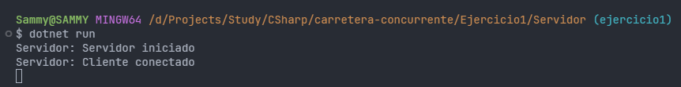
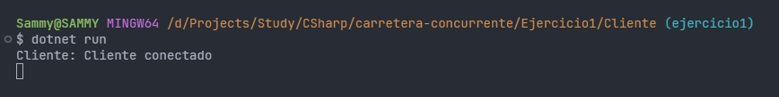
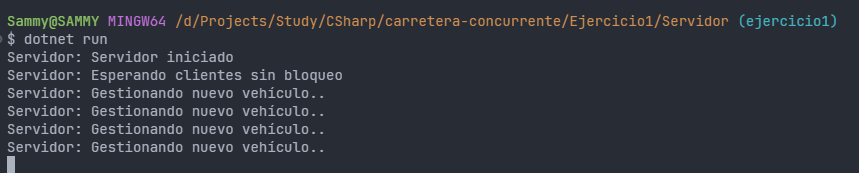
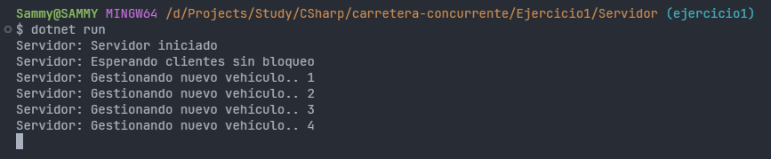
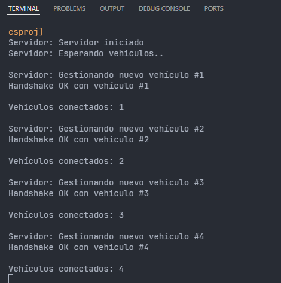

# EJERCICIO 1 - Conexión concurrente de clientes

 

### Descripción

Para esta tarea, se buscan los siguientes objetivos:

- [Etapa 1](#etapa-1) - Conexión servidor/cliente.
- [Etapa 2](#etapa-2) - Aceptación de clientes.
- [Etapa 3](#etapa-3) - Asignar un ID único a cada vehículo (cliente).
- [Etapa 4](#etapa-4) - Obtener el NetworkStream.
- [Etapa 5](#etapa-5) - Programar métodos EscribirMensajeNetworkStream y LeerMensajeNetworkStream.
- [Etapa 6](#etapa-6) - Handshake.
- [Etapa 7](#etapa-7) - Almacenar información de clientes conectados.

 

> [!NOTE]
> Sammy del futuro:
>   
> Para este ejercicio (según commits), se comenzó implementando el modelo APM (Asynchronous Programming Model) mediante el uso de Begin/End, pero más tarde se conoce que este modelo queda más anticuado y se recomienda la implementación del modelo TAP (Task-based Asynchronous Pattern). Permitiendo así la
> utilización de la tupla async/await (¡mola mucho esto!).

 

### Etapa 1
#### *Conexión servidor/cliente*

> **APM**:
> 
> Se implementa el código mediante el uso de Begin/Read, pasando un callback (EndAccept()) por parámetro en el cual se gestiona la conexión concurrente asíncrona. En la parte del cliente se comprueba la condición de si el TcpClient ha sido conectado y se muestra por pantalla, de lo contrario muestra un error.
> Una conexión bastante simple.
>
> **TAP**:
>
> Se aplica el término async Task en la firma de los métodos para poder hacer funcionar el modelo TAP. Con la famosa tupla async/await podemos gestionar cada conexión mediante el uso del await en el AcceptTcpClientAsync(). Una vez se realice la conexión, gestionamos dicho cliente mediente el método
> GestionarClienteAsync().

 

 

### Etapa 2
#### *Aceptación de clientes*

> **APM**:
> 
> Siguiendo un poco el código anterior, desde el mismo callback para la llamada de la "aceptación" delos clientes, se vuelve a ejecutar BeginAcceptTcpClient de forma recursica. De esta forma mantendríamos al servidor permanentemente a la escucha de nuevos clientes.
> 
> **TAP**:
> 
> Sin mucho más añadido, ya que este código va del mano prácticamente con la Etapa 1, se introduce el `await Server.AcceptTcpClientAsync()` junto a al método de gestión de clientes dentro de un bucle while/true. Facilmente conseguimos una ejecución continua a la recepción de clientes.

 

 

### Etapa 3
#### *Asignación ID*

> **APM** / **TAP**:
> 
> Para ambos modelos se ha implementado de la misma manera. Se ha utilizado la clase Interlock, la cual permite acceder a la variable `idUnico` de forma segura evitando condición de carrera. Se incrementa en 1 por cada cliente generado. De una forma sencilla podemos mantenter un sistema de generación de IDs
> únicos.
>
> `int clienteId = Interlocked.Increment(ref IdUnico);`

 

 

## Etapa 4
#### *Captura del NetworkStream*

> **APM** / **TAP**:
> 
> De la misma manera que para el ID, esto no es dificil de lograr en los dos modelos, es lo mismo. Se consigue el NetworkStream de cada cliante justo en el momento que la conexión se ha establecido. La sentencia es bastante sencilla:
>
> `NetworkStream netwS = cliente.GetStream();`

 

### Etapa 5
#### *Métodos lectura y escritura*

> **APM**:
> 
> Mediante el modelo APM, se inicia la lectura preparando un buffer de lectura. Seguidamente se llama al correspondiente método mediante el BeginRead pasándole el método callback por parámetro. Dentro de este "método delegado" se ejecuta el código de forma asíncrona, permitiendo así la lectura en segundo
> plano. Con el uso del EndRead, el sistema termina de leer, y con un sencillo control de condiciones, se puede llamar de forma recursiva al método BeginRead para que en todo momento, se puede mantener una escucha de datos constante. Para la escritura es más de lo mismo, se convierte el mensaje a bytes y se
> usa el buffer junto al delegado (callback) para ejecutar la escritura de forma asíncrona, validando su finalización con el uso del EndWrite.
> 
> **TAP**:
> 
> Con este modelo, la cosa se vuelve bastante más sencilla. Rescata el método de lectura y escritura más antiguo pero con la implementación del async/await. Nada de segundos métodos delegados ni callbacks explícitos, se prepara un MemoryStream, un buffer, y mediante el uso de un bucle do/while se leen los datos
> de forma continua hasta que `netwS.DataAvailable()` determina que ya no quedan más datos que leer. Lo mismo para la escritura pero con el uso del `WriteAsync()`.

 

### Etapa 6
#### *Handshake*

> **APM**:
> 
> El Handshake con este modelo se vuelve un poco más tedioso. La forma má correcta de realizarlo es mediante la implementación de callbacks anidados uno dentro del otro leyendo y escribiendo, llamando y buscando respuesta. << Te mando INICIO, ¡has recibido INICIO? (siguiente paso), te he asignado un ID, me
> confirmas que has recibido el mismo ID?, todo ok. Todos los pasos van anidados (un poco feo de mantener para mi gusto).
> 
> **TAP**:
> 
> Otro gallo canta. Nada de callbacks anidados, condiciones sencillas y pasos marcados con los correspondientes awaits y sus llamadas a métodos de lectura y escritura. Mismos pasos, ¿INICIO? ¿Mismo ID confirmado? todo ok.

 

### Etapa 7
#### *Almacenaje de información clientes*

> **Respuesta según el código**:
> 
> El primer paciente que entra en consulta es el Paciente 1. Si partimos de la base que genera el enunciado, cada llegada de paciente es separada por un lapso de tiempo de 2 segundos. En mi caso, siempre entrará primero el Paciente 1. Si, en lugar de mi código actual, hubiese creado una lista de 4 hilos y hubiese decidido que la ejecución de los mismos se hiciese de forma random, sacando aleatoriamente hilos de la lista, el orden de entrada podría ser diferente en cada ejecución.
> 
> Pero si leemos detenidamente el enunciado, dice: << Llega un paciente cada 2 segundos >>. En mi opinión, en esa sentencia, se confirma que la creación es en con ese intervalo, por lo tanto, siempre se ejecutará el mismo hilo en primer lugar.
> 
> En el segundo caso que he expuesto estaríamos dando por hecho que ya existen esos 4 pacientes (la lista de hilos pre-creada), y creo que no es el objetivo de esta tarea. Para que en este caso fuese totalmente válido en relación al enunciado, debería decir algo como: << En una sala de espera, donde hay 4 pacientes esperando, se les llama para entrar en consulta cada 2 segundos >>.

 

 
