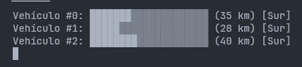
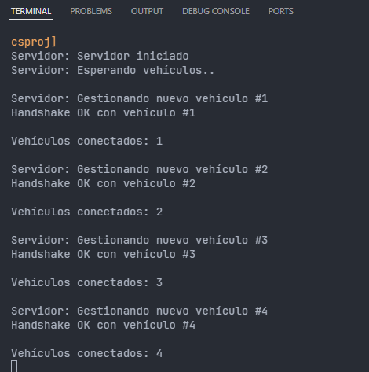

# EJERCICIO 2 - Intercambio de conexión entre vehículos

 

### Descripción

Para esta tarea, se buscan los siguientes objetivos:

- [Etapa 8](#etapa-8) - Conexión Servidor/Cliente.
- [Etapa 9](#etapa-9) - Aceptación de clientes.
- [Etapa 10](#etapa-10) - Asignar un ID único a cada vehículo (cliente).
- [Etapa 11](#etapa-11) - Obtener el NetworkStream.
- [Etapa 12](#etapa-12) - Programar métodos EscribirMensajeNetworkStream y LeerMensajeNetworkStream.

 

### Etapa 8
#### *Métodos clase NetworkStreamClass*

> Se implementa todo el código necesario aprendido para la lectura y escritura de los datos mediante un bucle el cual permite iterar hasta vaciar el NetworkStream.

 

> [!IMPORTANT]
> Tuve que implementar un header que estableciera la longitud del mensaje que se va recibir. Para un modelo sin `async`, es arriesgado pero no obligatorio, sin embargo, para un modelo `TAP` es obligatorio usar headers, de lo contrario podría estar leyendo menos bytes de los necesarios. O de lo contrario, leer
> más de un mensaje a la vez y mezclar contenido.

 

### Etapa 9
#### *Crear y enviar datos de un vehículo*

> En esta tarea se implementa un código sencillito en el que se crea una instancia del vehiculo en el cliente, se le asigna el ID y se envía el objeto Vehiculo de nuevo al Servidor (el ID asignado es el que se obtiene al completar el Handshake por parte del Servidor).

 

> [!NOTE]
> Las pruebas de esta tarea se reflejarán con la `Etapa 10` ya que sin esta, no se puede realizar la siguiente. Cazamos dos pájaros de un tiro.

 

### Etapa 10
#### *Mover los vehiculos*

> Para cumplir el objetivo de esta, se implementa un bucle for iterativo de 0 a 100, y mediante un `Thread.Sleep("cuanto mayor número más lento va el vehículo")` se consigue simular el movimiento de dicho vehículo. A cada iteración se envía la nueva información al Servidor.

 

 

> [!TIP]
> Como bien se ha dicho, la práctica dio un giro de 90º para implementar el modelo `TAP`, y una de las cosas que se me olvidó cambiar fue el `Thread.Sleep()` por el `Task.Delay()`. Si tenemos un modelo TAP y hacemos uso del Thread.Sleep(), estamos obligando al sistema a utilizar más recursos de los que debería
> incluso podría afectar al correcto funcionamiento del programa bloqueando el hilo por completo. Esto se corrige en la última parte de la práctica `Ejercicio 3` haciendo uso del Task.Delay().

 

## Etapa 11
#### *Enviar datos del servidor a todos los clientes*

> El Servidor recibe los datos del vehículo mediante la lectura que mencionamos anteriormente, los almacena en una nueva instancia `Vehiculo` y lo añade a la lista de vehículos que hay en la carretera. Posteriormente se envía el estado de la carretera con los cambios mediante un método específico. Este método,
> itera sobre todos los clientes que han sido registrados en el Servidor y les envía el estado de la carretera mediante el método de escritura que también se mencionó etapas atrás. Si ocurre algún error, elimina al cliente de la lista.

 

### Etapa 12
#### *Recepción de la información del Servidor en el cliente*

> Desde el Main de Cliente, se ejecuta una tarea `Task` que actualiza la carretera en segundo plano. El método que se emplea es un método que contiene un `while(true)` el cual está constantemente leyendo el Stream, permaneciendo a la escucha de nuevos cambios en la carretera. Una vez los tiene y los actualiza,
> ejecuta el siguiente método que permite mostrar la carretera. En él, se itera sobre todos los vehículos que hay en carretera y mediante un limpiado constante de la consola, va mostrando el recorrido que hace cada vehículo con sus respectivos datos.

 

 

> [!NOTE]
> Este proceso se ve mejorado en el `Ejercicio 3`, incrementando la calidad de ejecución y la calidad visual.

 

### Etapa 6
#### *Handshake*

> **APM**:
> 
> El Handshake con este modelo se vuelve un poco más tedioso. La forma má correcta de realizarlo es mediante la implementación de callbacks anidados uno dentro del otro leyendo y escribiendo, llamando y buscando respuesta. << Te mando INICIO, ¡has recibido INICIO? (siguiente paso), te he asignado un ID, me
> confirmas que has recibido el mismo ID?, todo ok. Todos los pasos van anidados (un poco feo de mantener para mi gusto).
> 
> **TAP**:
> 
> Otro gallo canta. Nada de callbacks anidados, condiciones sencillas y pasos marcados con los correspondientes awaits y sus llamadas a métodos de lectura y escritura. Mismos pasos, ¿INICIO? ¿Mismo ID confirmado? todo ok.

 

### Etapa 7
#### *Almacenaje de información clientes*

> **Respuesta según el código**:
> 
> El primer paciente que entra en consulta es el Paciente 1. Si partimos de la base que genera el enunciado, cada llegada de paciente es separada por un lapso de tiempo de 2 segundos. En mi caso, siempre entrará primero el Paciente 1. Si, en lugar de mi código actual, hubiese creado una lista de 4 hilos y hubiese decidido que la ejecución de los mismos se hiciese de forma random, sacando aleatoriamente hilos de la lista, el orden de entrada podría ser diferente en cada ejecución.
> 
> Pero si leemos detenidamente el enunciado, dice: << Llega un paciente cada 2 segundos >>. En mi opinión, en esa sentencia, se confirma que la creación es en con ese intervalo, por lo tanto, siempre se ejecutará el mismo hilo en primer lugar.
> 
> En el segundo caso que he expuesto estaríamos dando por hecho que ya existen esos 4 pacientes (la lista de hilos pre-creada), y creo que no es el objetivo de esta tarea. Para que en este caso fuese totalmente válido en relación al enunciado, debería decir algo como: << En una sala de espera, donde hay 4 pacientes esperando, se les llama para entrar en consulta cada 2 segundos >>.

 

 
