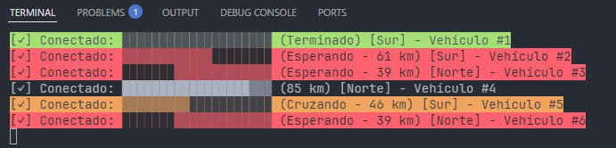

# EJERCICIO 3 - Control de tráfico en el puente

 

### Descripción

Para esta tarea, se buscan los siguientes objetivos:

- [Etapa 13](#etapa-13):
    - Solo un vehículo puede cruzar el puente
    - Todos los vehículos esperan hasta que salga el que lo está ocupando

 

> [!IMPORTANT]
> Es posible que del Ejercicio 2 al Ejercicio 3, haya cambiado el código en algunos de los ficheros. Esto es debido a las
> refactorizaciones que le he ido haciendo al código, por supuesto siempre con el objetivo de mejora y optimización. Por otro
> lado, después de documentar todo el código y de rellenar los README, también surgieron fallos/mejoras. (¡Esto es infinito!)

 

### Etapa 13
#### *Paso único por el puente*

> Para realizar la última tarea, en primer lugar se ha creado una nueva clase estática `Puente` en la que gestionaremos la entrada
> y salida del mismo. En ella instanciamos un `SemaphoreSlim(1,1)` que será el objeto que pare a los vehículos que quieran entrar
> en el puente ocupado. Mediante `WaitAsync()` y `Release()` manejamos dicho semáforo.
>
> De forma automática, el sistema, ya genera una "cola" de los objetos que van haciendo `WaitAsync`, pero como ya vimos en la
> práctica anterior gracias a la documentación oficial, el lenguaje no garantiza que el sistema vaya a respetar bajo cualquier
> circustancia dicho orden, pero para un comienzo puede valer (*ya veremos un poco más adelante en las preguntas de esta etapa*).
>
> Una vez creda la clase, se necesita implementar el código que permite la orquestación del puente. Para ello, dentro del método
> `GestionarVehiculo()`, se implemente la gestión del puente mediante el uso de `flags` (*enPuente = true/false*).
>
> De manera sistemática, también se ha gestionado la forma en la que el programa se comporta cuando un vehículo pierde la
> conexión justo cuando está cruzando el puente. Si esto no se gestiona, el puente quedaría totalmente bloqueado para siempre.
> Cuando un vehículo se desconecta mientras cruza el puente, este se libera y se elimina al cliente del entorno, monstrando sus
> respectivos mensajes por pantalla del servidor. (También se muestra un indicador en el lado del cliente).

 

#### Pregunta 1
`¿Qué ventajas e inconvenientes aparecen dependiendo de en qué entorno se programa el paso del puente? Cliente o Servidor`

> La respuesta es bastante interesante. Voy a desglosarlo un poco para que se pueda entender mejor:
> 
> ### **Controlar el paso del puente en el servidor** - (Lo que se está haciendo en este proyecto)
>
> - **Ventajas**
>   
>   - En el servidor, se conoce el estado global de todos los vehículos y puede controlar quién entra y cuando.
>   - Puedes temer decemas o cientos de clientes y el servidor, seguirá coordinando correctamente siempre que se use concurrencia
> segura (`lock`, `SemaphoreSlim`).
>   - El servidor puede actualizar en tiempo real el estado de la carretera para todos, y eso incluye mostrar qué vehículo está
> en el puente.
>   - Si un cliente se cae en el puente, el servidor puede detectarlo y liberar el recurso.
>     
>  
>
> - **Inconvenientes**
>   - Aumenta la responsabilidad y consumo de CPU, sobre todo si se gestionan muchos clientes simultáneos.
>   - Se debe gestionar de forma correcta el uso de la concurrencia.
>
>  
>
> ### **Controlar el paso del puente en el cliente**
>
> - **Ventajas**
>   - El servidor solo sería pasivo, almacenaría el estado y los clientes se gestionarían.
>   - No haría falta implementar colas ni semáforos en el servidor.
>
>  
>
> - **Inconvenientes**
>   - Sin una vista global, dos o más clientes podrían decidir entrar al mismo tiempo.
>   - Si los clientes tienen percepciones diferentes del estado del puente (lag o errores), puede haber colisiones lógicas.
>   - Si un cliente se cae dentro del puente, no habría manera alguna de que los demás lo supieran si el control no es
> centralizado.
>   - Cada uno tendría que implementar la lógica de coordinación y eso va en contra de los principios de *cliente ligero* (Estuve
> buscando información sobre esto, interesante)

 

#### Pregunta 2
`¿Cómo gestionarías las colas de espera en el Servidor?¿Qué estructura de datos usarías para priorizar vehículos según su dirección?`

> Después de realizar la primera práctica, creo que hay un elemento que se lleva la palma: `PriorityQueue()`. Tal y como su
> nombre indica, esta clase nos permite almacenar elementos en una cola por prioridad. Se gestiona a través de sus parámetros:
> `TElement` y `TPriority`. En el caso de los vehículos, se puede almacenar por `Vehiculo` & `int`. Una vez dentro de la lógica
> del puente, se almacena en una variable si viene del Sur o del Norte:
>
> `int prioridad = vehiculo.Direccion == "Sur" ? 0 : 1;`
>
> Y de esta forma, mediante un int, se puede gestionar la prioridad.

 

> [!NOTE]
> PLUS:
>
> Y por supuesto, como no podía ser menos, he decidido implementar esta lógica de la `PriorityQueue<TElement,TPriority>`. Dentro
> del código se puede ver la lógica implementada. Todo está dentro del archivo `Puente.cs`. Los coches con dirección `Sur` tienen
> prioridad sobre los que tienen dirección `Norte`.

 

## APLICACIÓN FINAL

 

<em>Cliente</em>

 

<em>Servidor</em>

 

> [!IMPORTANT]
> PLUS:
>
> También se puede observar de forma llamativa cómo el sistema gestiona las caídas de los clientes cuando el vehículo se
> desconectado o cuando está cruzando el puente.

 

<em>Cliente</em>

 

<em>Servidor</em>

 

# THE END :D.

 
